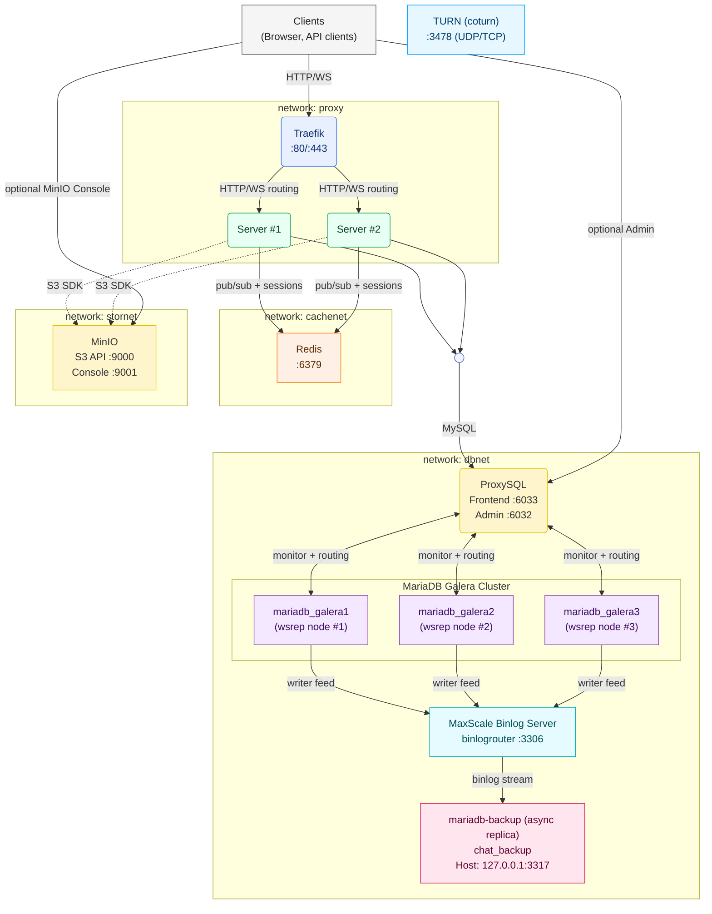

# Dev Infrastructure V4 (Official)

This document describes the final V4 infrastructure used by the Real‑Time Chat project. It explains the architectural choices, how components interact, and how to operate and scale the system in development and production.

- Primary reference compose files:
  - Development: `docker-compose.devV4.yml`
  - Production: `docker-compose.prodV4.yml`
  - Latest topology reference: `docker-compose.yml`

## High‑Level Architecture

## Key Components and Rationale

- Traefik (Gateway / Reverse Proxy)
  - Routes HTTP traffic to the app servers and exposes a dashboard for diagnostics.
  - Simplifies local development and production by using Docker labels for dynamic routing.
  - Can enable HTTPS with Let’s Encrypt in production.
  - Dev note: when using ngrok on port 80, avoid HTTP→HTTPS redirection loops (TLS termination happens upstream).

- Express/Socket.IO Server (Horizontally Scalable)
  - The Node.js server runs 2+ replicas (`scale: 2` in compose). Horizontal scaling is enabled because Socket.IO uses Redis as a Pub/Sub adapter. This lets different server instances broadcast and receive events consistently.
  - `TRUST_PROXY=true` so Express can correctly determine the originating IP/host behind Traefik.
  - WebRTC signaling, file management, authentication, and chat messaging are handled here.

- Redis (Cache / PubSub / Rate‑Limiting)
  - Acts as the Socket.IO adapter backend for inter‑instance event propagation, allowing multiple server replicas to behave like a single real‑time cluster.
  - Is also used for caching and simple rate‑limiting or ephemeral coordination tasks.

- MinIO (S3‑Compatible Object Storage)
  - Stores attachments and media. S3 compatibility allows the same code paths to work with AWS S3 in production or MinIO locally.
  - `S3_PUBLIC_URL_BASE` lets the server generate user‑facing public URLs (via Traefik route to MinIO). In dev, this is typically `http://localhost/minio/<bucket>`.
  - Using object storage avoids bloating the app containers and simplifies stateless scaling of servers.

- MariaDB Galera Cluster (3 nodes)
  - A multi‑master synchronous replication cluster for high availability and strong consistency guarantees.
  - Any node can accept writes; Galera handles certification‑based replication and conflict detection. The triple‑node setup improves quorum and resilience.
  - Benefits: automatic failover, consistent reads/writes, and no single primary bottleneck.

- ProxySQL (Primary SQL Access Layer)
  - The application connects to ProxySQL (e.g., `proxysql:6033`) rather than directly to a Galera node.
  - Provides connection pooling, query routing, and health‑aware load balancing across Galera nodes.
  - Hides topology changes from the application and reduces connection churn on DB nodes.

- MariaDB MaxScale (Monitoring / Topology Management)
  - Deployed to monitor the Galera cluster and provide operational tooling (read/write splitting modes, failover assistance, and observability).
  - In our topology, the server app uses ProxySQL as its main access point; MaxScale enhances operability and can be used for migrations, maintenance windows, or as a future alternative/augmentation for routing strategies.

- MariaDB Backup Node
  - A dedicated MariaDB instance for backups/restore workflows. The application has separate backup credentials and database names for this node.
  - Used for scheduled logical backups, ad‑hoc dumps, and disaster recovery drills without impacting the production cluster.

- STUN/TURN (WebRTC Connectivity)
  - STUN: uses Google’s public STUN for NAT discovery.
  - TURN: a local TURN server is provided for relaying media when peer‑to‑peer traversal fails. In production, configure public DNS and valid TLS.

## Networks and Traffic Flow

- Networks
  - `proxy`: Traefik ⇄ App Servers, and optionally MinIO public route.
  - `dbnet`: App Servers ⇄ ProxySQL/MaxScale ⇄ Galera.
  - `cachenet`: App Servers ⇄ Redis.
  - `stornet`: App Servers ⇄ MinIO.

- Request Flow (typical HTTP/WebSocket)
  1. Browser connects to Traefik on `:80` (or `:443` in prod).
  2. Traefik routes to one of the Server replicas based on router rules.
  3. Server reads/writes messages and room state via ProxySQL into the Galera cluster.
  4. For real‑time events, Server publishes via Redis; other replicas receive and forward to their connected clients.
  5. For media/attachments, Server signs/constructs S3 URLs to MinIO (served back to the browser via Traefik).

## Scaling Strategy

- Horizontal scaling of the Node.js servers is enabled by:
  - Stateless application design for HTTP routes and Socket.IO.
  - Redis Pub/Sub adapter to synchronize events across replicas.
  - Externalized state: DB for persistence, MinIO for files.

- To increase capacity:
  - Raise the replica count of the `server` service in Compose/Swarm/Kubernetes.
  - Ensure Redis and the database tier have sufficient resources.
  - Consider sticky sessions only if absolutely necessary; Socket.IO generally maintains its own connection state and leverages the Redis adapter to avoid stickiness.

## Database Topology and Behavior

- Galera:
  - Synchronous replication with write‑set certification. A write succeeds when a majority of nodes certify and apply it.
  - Any node can handle writes/reads; practical deployments often route through a proxy for pooling and health checks.

- ProxySQL in front of Galera:
  - Distributes connections and queries across healthy nodes.
  - Shields app from node failures or maintenance. If a node is down, ProxySQL routes around it.
  - Can be tuned for read/write separation if desired, though Galera is multi‑master; conservative write routing can still help during network partitions.

- MaxScale’s role:
  - Monitors node health and replication state; useful for visibility and controlled failover strategies.
  - Provides an additional operational path for read scaling modes or during topology changes.

- Backup MariaDB:
  - Separate instance for backups or staging restores. Not in the main query path.
  - Credentials and DB names are distinct (see environment variables like `MARIADB_*_BACKUP`).

## Object Storage and Public URLs

- MinIO is addressed internally by the app via `S3_ENDPOINT` (e.g., `http://minio:9000`).
- For public access, the server constructs links using `S3_PUBLIC_URL_BASE`. In development this is typically proxied by Traefik so browsers can fetch objects from `http://localhost/minio/<bucket>/...`.
- Use `S3_USE_PATH_STYLE=true` for MinIO compatibility in local environments.

## Security Considerations

- Development credentials (Redis, MinIO, MariaDB) are intentionally simple; always rotate and secure them for production.
- Enable HTTPS with Let’s Encrypt in production by turning on the `websecure` entrypoint and ACME resolver in Traefik; ensure DNS points to the host.
- Configure strong TURN credentials and TLS certificates when exposing TURN publicly.
- Restrict Traefik dashboard in production (disable `--api.insecure=true` and put the dashboard behind auth or local‑only access).

## Operations

- Bring‑up (dev):
  - `docker compose -f docker-compose.devV4.yml up -d --build`
  - Server default: `http://localhost:3080` (proxied at `http://localhost/` via Traefik depending on labels/routes).

- Scaling app servers:
  - Example: `docker compose -f docker-compose.devV4.yml up -d --scale server=3`
  - Verify Redis and DB tiers can handle additional load.

- Health and Monitoring:
  - Use Traefik dashboard (disable in prod or protect it).
  - ProxySQL and MaxScale expose admin interfaces for DB routing/health. Consult their docs for credentials and ports used in your compose files.

- Backups and Restore:
  - Perform logical dumps from the Galera cluster to the Backup node, or run dumps directly on the Backup node if using it as a staging restore target.
  - Periodically test restores to validate recovery time and data integrity.

## Environment Variables (Highlights)

- Server
  - `PORT`, `TRUST_PROXY`, `BCRYPT_COST`
  - Redis: `REDIS_URL`, `REDIS_HOST`, `REDIS_PORT`, `REDIS_PASSWORD`, `REDIS_TLS`
  - S3/MinIO: `S3_ENDPOINT`, `S3_REGION`, `S3_ACCESS_KEY`, `S3_SECRET_KEY`, `S3_BUCKET`, `S3_USE_PATH_STYLE`, `S3_PUBLIC_URL_BASE`
  - DB (primary): `MARIADB_HOST=proxysql`, `MARIADB_PORT=6033`, `MARIADB_DB`, `MARIADB_USER`, `MARIADB_PASSWORD`, `MARIADB_SSL`
  - DB (backup): `MARIADB_HOST_BACKUP`, `MARIADB_PORT_BACKUP`, `MARIADB_DB_BACKUP`, `MARIADB_USER_BACKUP`, `MARIADB_PASSWORD_BACKUP`, `MARIADB_SSL_BACKUP`
  - WebRTC: `WEBRTC_STUN`, `WEBRTC_TURN_URLS`, `WEBRTC_TURN_USERNAME`, `WEBRTC_TURN_CREDENTIAL`, `CALL_RING_TIMEOUT`

Refer to the compose files for the exact values used in dev vs prod.

## Dev vs Prod Notes

- Development (devV4):
  - Simple credentials and HTTP by default.
  - Traefik dashboard is enabled and insecure mode may be on for convenience.
  - TURN is local; STUN uses public Google server.

- Production (prodV4):
  - Enable HTTPS (Traefik `websecure` + ACME). Configure `S3_PUBLIC_URL_BASE` with the public domain.
  - Harden credentials for Redis, MinIO, and MariaDB. Restrict dashboards and admin ports.
  - Consider enabling read/write policies in ProxySQL/MaxScale appropriate for your workload.
  - Ensure TURN has valid public DNS, TLS, and a secure long‑term credential mechanism.

## Troubleshooting

- WebSockets failing randomly:
  - Check Redis connectivity (required for cross‑replica events). Inspect Redis logs and server container logs.
  - Ensure Traefik is not terminating WebSocket upgrades (router/service config must permit upgrades).

- DB write errors or stalls:
  - Verify Galera node health and quorum. Look for certification conflicts and flow control events.
  - Ensure ProxySQL sees all nodes as healthy and is routing appropriately.

- Attachment URLs 404 or expire:
  - Confirm `S3_PUBLIC_URL_BASE` matches the public route and bucket name.
  - Check MinIO service health and bucket policies.

- TURN not relaying media:
  - Verify TURN credentials and that the service is reachable on the configured ports from clients.

---

For an end‑to‑end overview of the project and local commands, see `README.md`. For backend details and the test UI, see `server/Express/README.md` and `server/Express/public/README.md`.

