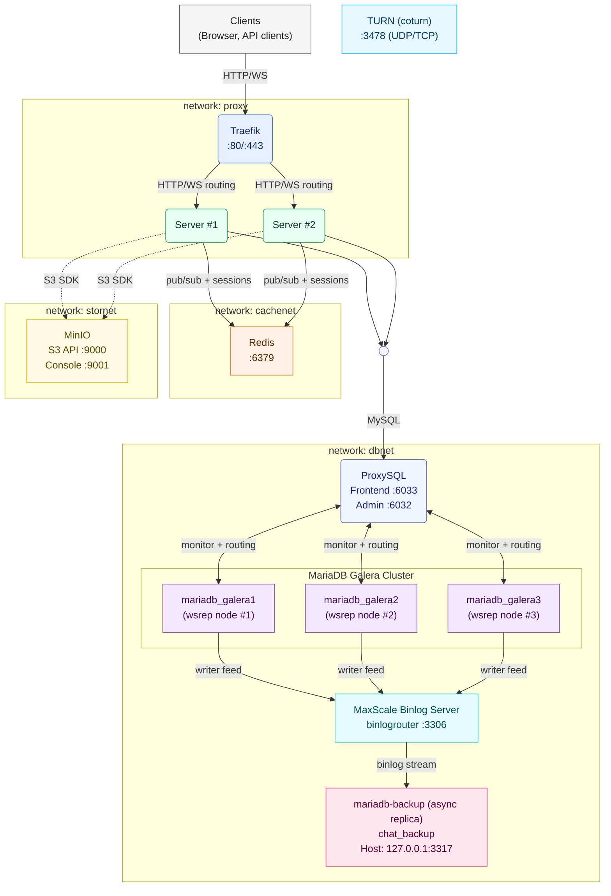

# Prod Infrastructure V4 (Official)

This document describes the production V4 infrastructure used by the Real‑Time Chat project. It mirrors the Dev guide but focuses on hardening, HA, and operational reliability.

- Primary reference compose files:
  - Production: `docker-compose.prodV4.yml`
  - Development: `docker-compose.devV4.yml` (for comparison)
  - Latest topology reference: `docker-compose.yml`

## High‑Level Architecture

## Key Components and Rationale (Production)

- Traefik (Gateway / Reverse Proxy)
  - Terminates TLS (Let’s Encrypt via ACME). Enable `websecure` entrypoint and ACME resolver in production; point DNS to the host.
  - Use secure dashboard practices: disable `--api.insecure=true` and protect dashboard behind auth or restrict to internal networks.
  - Docker label–based routing keeps config close to services.

- Express/Socket.IO Server (Horizontally Scalable)
  - Multiple replicas for HA and throughput; Socket.IO uses Redis adapter for inter‑instance Pub/Sub.
  - `TRUST_PROXY=true` to ensure accurate client IP/host behind Traefik.

- Redis (Cache / PubSub / Limits)
  - Backend for Socket.IO adapter; also suitable for caching, throttling, and session/presence.
  - Harden with strong credentials, optional TLS if required, and network policies.

- MinIO (S3‑Compatible Object Storage)
  - Stores user uploads/attachments. Use long, random access keys; rotate regularly.
  - `S3_PUBLIC_URL_BASE` should use your public domain via Traefik. Consider signed URLs and short expirations for sensitive objects.

- MariaDB Galera Cluster (3 nodes)
  - Synchronous multi‑master replication for strong consistency and HA.
  - Monitor cluster health (wsrep status, flow control) and ensure quorum.

- ProxySQL (Primary SQL Access Layer)
  - App connects to `proxysql:6033`; ProxySQL pools connections, routes around unhealthy nodes, and can apply read/write policies.
  - Protect admin interface; restrict access to operators only.

- MariaDB MaxScale (Monitoring / Topology Ops)
  - Provides monitoring, binlog routing, and optional read/write split strategies.
  - Useful for controlled failovers and observability alongside ProxySQL.

- MariaDB Backup Node
  - Dedicated instance for backups/restores; keeps production cluster load lower during maintenance.
  - Implement retention, encryption at rest, and off‑site copies according to your RPO/RTO.

- STUN/TURN (WebRTC Connectivity)
  - TURN must be reachable publicly with proper DNS and TLS; use secure long‑term credentials.
  - STUN for NAT discovery; use redundant servers for resilience.

## Networks and Traffic Flow

- Networks
  - `proxy`: Public ingress (Traefik) to app servers; optional MinIO route.
  - `dbnet`: App servers to ProxySQL/MaxScale to Galera.
  - `cachenet`: App servers to Redis.
  - `stornet`: App servers to MinIO.

- Request/Data Flow
  1. Client connects over HTTPS to Traefik.
  2. Traefik routes to one of the app replicas.
  3. App performs DB ops through ProxySQL to Galera; MaxScale monitors topology.
  4. Real‑time events propagate via Redis adapter across app replicas.
  5. Files are stored/retrieved via MinIO; links use `S3_PUBLIC_URL_BASE`.

## Production Hardening Checklist

- Traefik
  - Enable `websecure` and ACME; disable `--api.insecure=true`.
  - Redirect HTTP→HTTPS at the edge unless using an upstream tunnel that already terminates TLS.

- Secrets & Credentials
  - Strong, rotated credentials for Redis, MinIO, and MariaDB users.
  - Use secrets management (Docker secrets, Vault, etc.) instead of plaintext envs when possible.

- Database
  - Monitor Galera wsrep metrics; ensure 3‑node quorum.
  - Tune ProxySQL for your workload; restrict admin access.
  - Implement regular backups on the backup node; test restore procedures.

- Networking & Access
  - Restrict admin consoles (Traefik, MinIO, ProxySQL/MaxScale) to internal networks/VPN.
  - Consider TLS for Redis and DB connections if crossing untrusted links.

- Observability
  - Centralize logs and metrics (Traefik, app, Redis, DB, ProxySQL/MaxScale).

## Operations

- Bring‑up (prod profile):
  - `docker compose -f docker-compose.prodV4.yml up -d --build`

- Scaling app servers:
  - `docker compose -f docker-compose.prodV4.yml up -d --scale server=3`
  - Verify Redis and DB tiers capacity; watch wsrep flow control.

- Backups & Restore
  - Schedule dumps/physical backups on the backup node. Keep multiple restore points and test regularly.

## Environment Variables (Highlights)

- Server
  - `PORT`, `TRUST_PROXY`, `BCRYPT_COST`
  - Redis: `REDIS_URL`, `REDIS_HOST`, `REDIS_PORT`, `REDIS_PASSWORD`, `REDIS_TLS`
  - S3/MinIO: `S3_ENDPOINT`, `S3_REGION`, `S3_ACCESS_KEY`, `S3_SECRET_KEY`, `S3_BUCKET`, `S3_USE_PATH_STYLE`, `S3_PUBLIC_URL_BASE`
  - DB (primary): `MARIADB_HOST=proxysql`, `MARIADB_PORT=6033`, `MARIADB_DB`, `MARIADB_USER`, `MARIADB_PASSWORD`, `MARIADB_SSL`
  - DB (backup): `MARIADB_HOST_BACKUP`, `MARIADB_PORT_BACKUP`, `MARIADB_DB_BACKUP`, `MARIADB_USER_BACKUP`, `MARIADB_PASSWORD_BACKUP`, `MARIADB_SSL_BACKUP`
  - WebRTC: `WEBRTC_STUN`, `WEBRTC_TURN_URLS`, `WEBRTC_TURN_USERNAME`, `WEBRTC_TURN_CREDENTIAL`, `CALL_RING_TIMEOUT`

Refer to `docker-compose.prodV4.yml` for the exact values and adjust for your domain and secrets management.

## Troubleshooting (Prod)

- WebSockets drops across replicas
  - Verify Redis connectivity and that the adapter is configured; inspect logs.

- Galera stalls or certification conflicts
  - Check wsrep status, network latency, and flow control; route writes conservatively if needed.

- TLS/ACME fails
  - Ensure DNS points to host; check Traefik logs and ACME email/storage configuration.

- Object URLs invalid
  - Confirm `S3_PUBLIC_URL_BASE` uses your public domain and correct bucket; verify MinIO policies.

---

See also: `docs/InfraDevV4.md` (dev guide) and `docs/ServerInfrastructure.md` (index and pointers).
